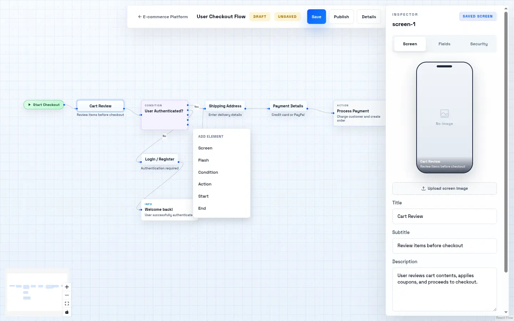
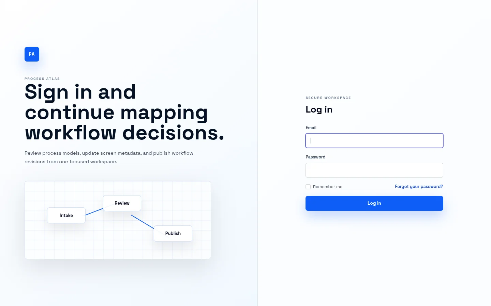
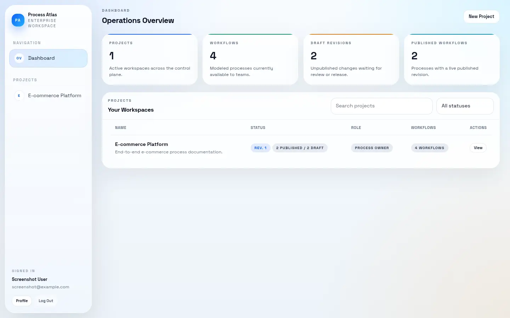
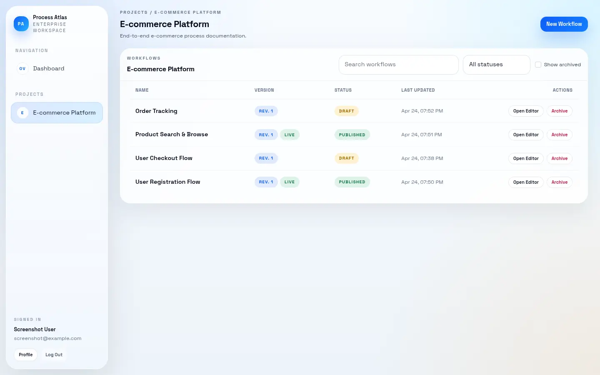

# Process Atlas

> A process modeling and documentation platform built for agentic development — design, revise, and publish visual workflows that AI agents can understand and navigate via MCP.

[](https://php.net)
[](https://laravel.com)
[](https://react.dev)
[](https://www.typescriptlang.org)
[](LICENSE)

---

## What is Process Atlas?

Process Atlas is a web application for **modeling, documenting, and tracking revisions of business processes** as visual flow diagrams. It is designed with **agentic development** in mind — the process definitions created here are intended to be consumed by AI agents through **MCP (Model Context Protocol)**, giving agents a structured, up-to-date understanding of application processes, user flows, and business logic before and during autonomous task execution.

Instead of an AI agent blindly navigating an unfamiliar system, it can query Process Atlas via MCP to answer questions like:

- *"What screens does the checkout flow consist of?"*
- *"What conditions branch this process and what are the outcomes?"*
- *"Where does this workflow hand off to another process?"*

Process Atlas is the living map that agents read.

---

## Screenshots

<p align="center">
  
</p>

<p align="center">
  
  &nbsp;
  
  &nbsp;
  
</p>

---

## Key Features

- **Visual process editor** — drag-and-drop canvas powered by [@xyflow/react](https://xyflow.com)
- **MCP integration** — process definitions exposed as MCP resources for AI agent consumption
- **Rich node vocabulary** — Start, End, Screen, Flash (notification), Condition (branching), Action
- **Workflow chaining** — End nodes link to downstream workflows, modeling multi-stage processes
- **Screen documentation** — attach UI mockup images, descriptions, and typed custom fields to any step
- **Revision control** — draft/publish lifecycle with rollback to any previous revision
- **Role-based access** — granular `workflows.view`, `workflows.edit`, `workflows.publish` permissions
- **Optimistic locking** — concurrent edit conflict detection
- **Activity log** — full audit trail of all changes

---

## Tech Stack

| Layer | Technology |
|---|---|
| Backend | PHP 8.5, Laravel 13, Inertia.js |
| Frontend | React, TypeScript, Vite, Tailwind CSS |
| Canvas | @xyflow/react |
| MCP | Model Context Protocol server (process resources & tools) |
| Database | PostgreSQL |
| Cache / Sessions / Queue | Redis |
| Infrastructure | Docker (php-fpm + nginx + node), SSL via mkcert |

---

## MCP Protocol

Process Atlas exposes a standard MCP JSON-RPC server over:

- HTTP: `POST /api/mcp` (requires `auth:sanctum` and `mcp.use`)
- Stdio: `php artisan mcp:serve-stdio --user=<id>`

Supported MCP methods:

- `initialize`, `notifications/initialized`, `ping`
- `tools/list`, `tools/call`
- `resources/list`, `resources/read`, `resources/templates/list`

Resource URIs use the `process-atlas://` scheme (for example `process-atlas://workflows/12`).

---

## Getting Started

### Prerequisites

- [Docker](https://www.docker.com/)
- [mkcert](https://github.com/FiloSottile/mkcert) for local HTTPS

### 1. Trust the local CA

```shell
mkcert -install
```

### 2. Build and start containers

```shell
make init
```

This generates SSL certificates, creates the Docker network, and starts all services.

### 3. Bootstrap the application

```shell
make php
composer setup
```

`composer setup` installs PHP & JS dependencies, generates the app key, and runs migrations.

### 4. Open in browser

```
https://localhost
```

---

## Development Commands

| Command | Description |
|---|---|
| `make up` | Start containers in detached mode |
| `make down` | Stop and remove containers |
| `make logs` | Stream logs from all containers |
| `make rebuild` | Rebuild images without cache |
| `make reload` | Rebuild images with cache |
| `make php` | Open a shell in the PHP container |
| `make node` | Open a shell in the Node container |
| `make node-sync` | Copy `node_modules` from container to host |

All `php artisan` and `npm` commands must be run inside their respective containers:

```shell
# PHP / Artisan
docker compose exec php-fpm php artisan migrate

# Node / npm
docker compose exec node npm run build
```

---

## Project Structure

```
process_atlas/
├── build/          # Docker build files and NGINX config
├── src/            # Laravel application
│   ├── app/
│   │   ├── Http/Controllers/
│   │   ├── Models/         # Workflow, WorkflowVersion, Screen, ...
│   │   └── Services/
│   ├── resources/
│   │   ├── js/
│   │   │   ├── Pages/      # Inertia page components (React + TypeScript)
│   │   │   └── types/
│   │   └── css/
│   ├── routes/
│   └── database/migrations/
├── compose.yaml
├── makefile
└── LICENSE
```

---

## License

MIT © [Robert Ďurica](LICENSE)
