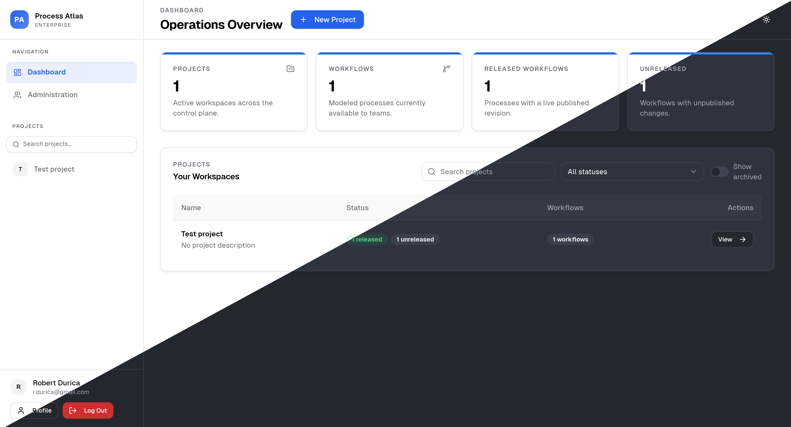
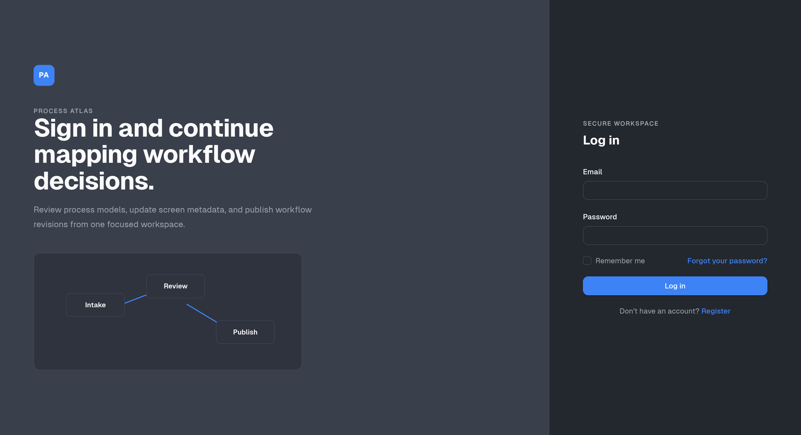
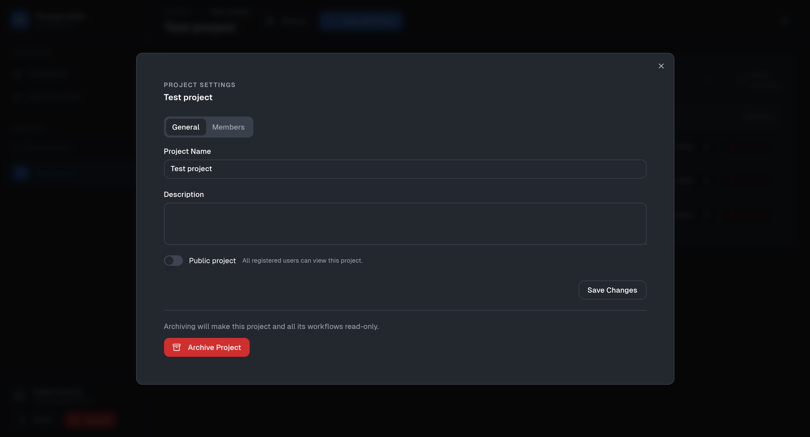
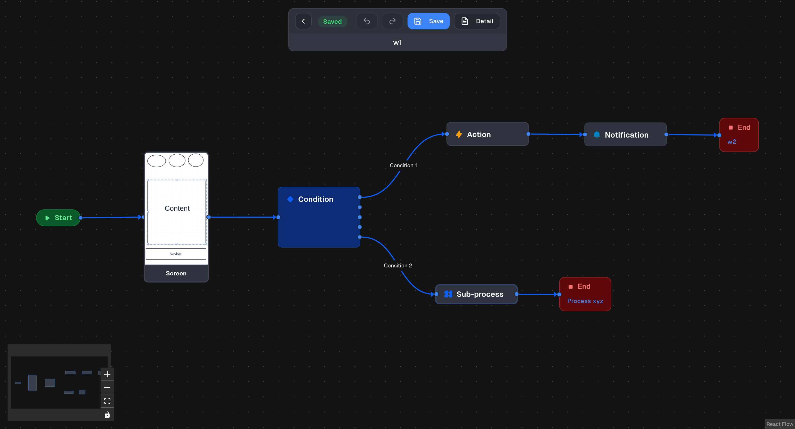

# Process Atlas

A process modeling and documentation platform built for agentic development — design, revise, and publish visual workflows that AI agents can understand and navigate via MCP.

[](https://php.net)
[](https://laravel.com)
[](https://react.dev)
[](https://www.typescriptlang.org)
[](LICENSE)
[](https://github.com/rdurica/process_atlas/pkgs/container/process_atlas)

<p align="center">
  
</p>

<p align="center">
  
  &nbsp;
  
  &nbsp;
  
</p>

## Table of Contents

- [Key Features](#key-features)
- [Demo](#demo)
- [Installation](#installation)
- [Tech Stack](#tech-stack)
- [MCP Protocol](#mcp-protocol)
- [License](#license)

## Key Features

- **Visual process editor** — drag-and-drop canvas powered by [@xyflow/react](https://xyflow.com)
- **MCP integration** — process definitions exposed as MCP resources for AI agent consumption
- **Workflow chaining** — End nodes link to downstream workflows, modeling multi-stage processes
- **Screen documentation** — attach UI mockup images, descriptions, and typed custom fields to any step
- **Revision control** — draft/publish lifecycle with rollback to any previous revision
- **Role-based access** — granular `workflows.view`, `workflows.edit`, `workflows.publish` permissions
- **Optimistic locking** — concurrent edit conflict detection
- **Activity log** — full audit trail of all changes

## Demo

The fastest way to try Process Atlas — everything runs in Docker, no dependencies needed:

```shell
docker compose -f compose.demo.yaml up
```

Open **http://localhost:8080**. The database is migrated automatically on first start.

To create demo user accounts, run:

```shell
docker compose -f compose.demo.yaml exec app php artisan db:seed
```

| Role | Email | Password |
|------|-------|----------|
| Admin | admin@example.com | password |
| Process Owner | owner@example.com | password |
| User | user@example.com | password |

Stop with `Ctrl+C` or `docker compose -f compose.demo.yaml down`. Data persists in a Docker volume.

## Installation

**Prerequisites**

- [Docker](https://www.docker.com/)

**Local setup**

```shell
make init          # Build images & start containers
make trust-cert    # Trust Caddy's local CA
make php           # Shell into the container
composer setup     # Install deps, generate key, migrate, build assets
```

Open **https://localhost**.

All commands run inside the `process-atlas` container:

```shell
docker compose exec process-atlas php artisan migrate
docker compose exec process-atlas npm run build
```

See [`makefile`](makefile) for the full list of available commands.

**Frontend quality**

```shell
docker compose exec process-atlas npm run typecheck
docker compose exec process-atlas npm run lint
docker compose exec process-atlas npm run format:check
```

**Production**

The Docker image is available at `ghcr.io/rdurica/process_atlas`. It requires external PostgreSQL and Redis. By default the image waits for DB/Redis and runs migrations on start.


Use `src/.env.production.example` as a base for production environment variables.

## Tech Stack

| Layer | Technology |
|-------|-----------|
| Backend | PHP 8.5, Laravel 13, Inertia.js |
| Frontend | React, TypeScript, Vite, Tailwind CSS |
| Canvas | @xyflow/react |
| MCP | Model Context Protocol server (process resources & tools) |
| Database | PostgreSQL |
| Cache / Sessions / Queue | Redis |
| Infrastructure | Docker (FrankenPHP) |

## MCP Protocol

Process Atlas exposes a standard MCP JSON-RPC server. See [MCP documentation](docs/MCP.md) for details on setup, authentication, resources, tools, and configuration.

## License

MIT © [Robert Ďurica](LICENSE)
