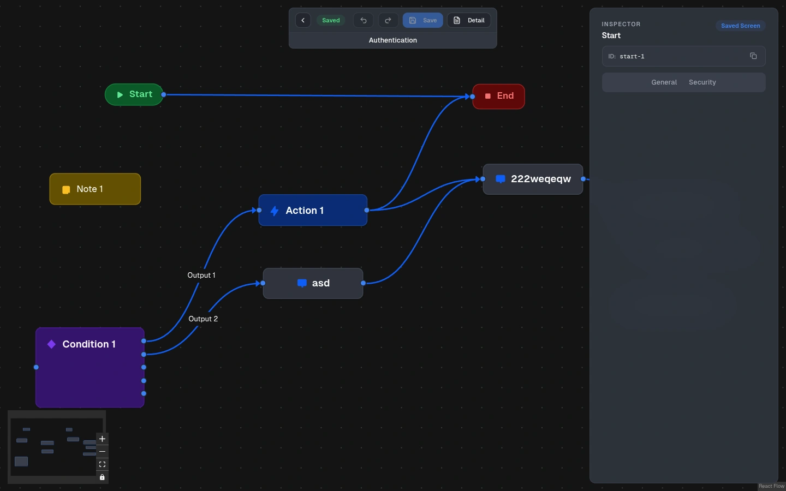
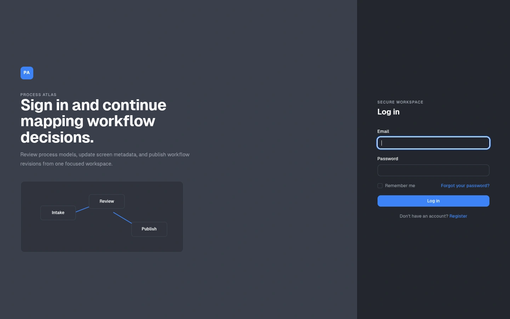
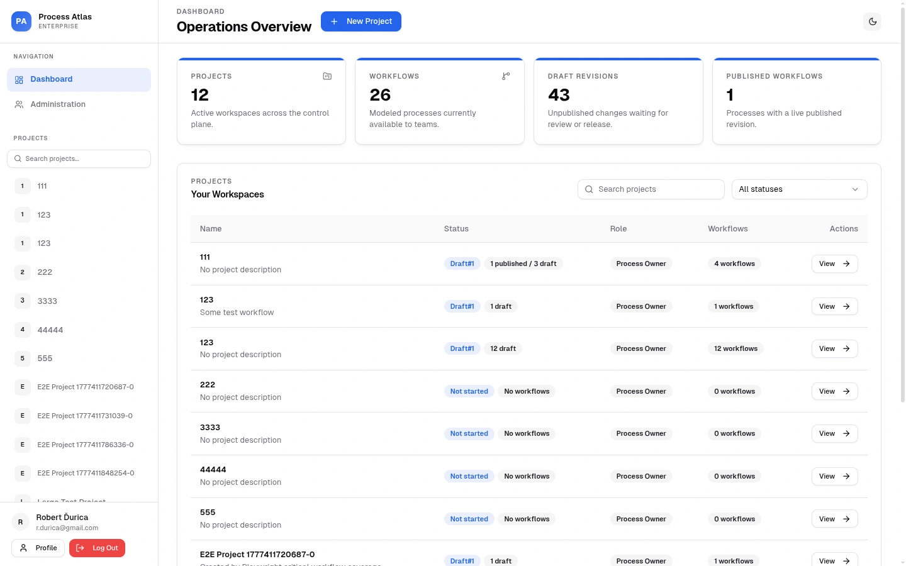
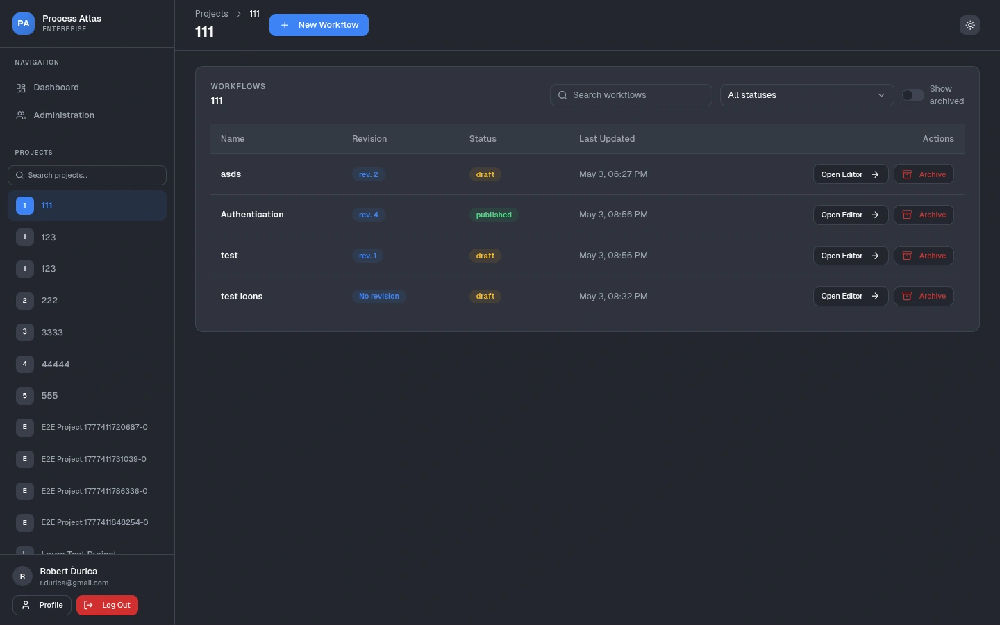

# Process Atlas

> A process modeling and documentation platform built for agentic development — design, revise, and publish visual workflows that AI agents can understand and navigate via MCP.

[](https://php.net)
[](https://laravel.com)
[](https://react.dev)
[](https://www.typescriptlang.org)
[](LICENSE)
[](https://github.com/rdurica/process_atlas/pkgs/container/process_atlas)

---

## Quick Start

The fastest way to try Process Atlas — everything runs in Docker, no dependencies needed:

```shell
docker compose -f compose.demo.yaml up
```

Open **http://localhost:8080**. The database is migrated automatically on first start.

To create demo user accounts, run:

```shell
docker compose -f compose.demo.yaml exec app php artisan db:seed
```

| Role | Email | Password |
|------|-------|----------|
| Admin | admin@example.com | password |
| Process Owner | owner@example.com | password |
| User | user@example.com | password |

Stop with `Ctrl+C` or `docker compose -f compose.demo.yaml down`. Data persists in a Docker volume.

---

## Production

The Docker image is available at `ghcr.io/rdurica/process_atlas`. It requires external PostgreSQL and Redis. By default the image waits for DB/Redis and runs migrations on start. For Kubernetes where migration is a separate Job, override the command:

```shell
command: ["/usr/local/bin/start.sh"]
```

Use `src/.env.production.example` as a base for production environment variables. For Kubernetes, see `build/prod/manifest-template.yaml` for a full deployment manifest.

---

## Development

### Prerequisites

- [Docker](https://www.docker.com/)
- [mkcert](https://github.com/FiloSottile/mkcert) for local HTTPS

### Setup

```shell
mkcert -install          # Trust the local CA (once)
make init                # Build images, generate certs, start containers
make php                 # Shell into the PHP container
composer setup           # Install deps, generate key, run migrations
```

Open **https://localhost** (local dev uses HTTPS via mkcert).

### Commands

| Command | Description |
|---------|-------------|
| `make up` | Start containers in detached mode |
| `make down` | Stop and remove containers |
| `make logs` | Stream logs from all containers |
| `make rebuild` | Rebuild images without cache |
| `make reload` | Rebuild images with cache |
| `make php` | Open a shell in the PHP container |
| `make node` | Open a shell in the Node container |
| `make node-sync` | Copy `node_modules` from container to host |
| `make pint` | Run Laravel Pint code formatter |
| `make test` | Run Pest PHP tests |
| `make phpstan` | Run PHPStan static analysis |

All `php artisan` and `npm` commands must run inside their containers:

```shell
docker compose exec php-fpm php artisan migrate
docker compose exec node npm run build
```

### Frontend quality

```shell
docker compose exec node npm run typecheck
docker compose exec node npm run lint
docker compose exec node npm run format:check
```

---

## Key Features

- **Visual process editor** — drag-and-drop canvas powered by [@xyflow/react](https://xyflow.com)
- **MCP integration** — process definitions exposed as MCP resources for AI agent consumption
- **Rich node vocabulary** — Start, End, Screen, Flash (notification), Condition (branching), Action
- **Workflow chaining** — End nodes link to downstream workflows, modeling multi-stage processes
- **Screen documentation** — attach UI mockup images, descriptions, and typed custom fields to any step
- **Revision control** — draft/publish lifecycle with rollback to any previous revision
- **Role-based access** — granular `workflows.view`, `workflows.edit`, `workflows.publish` permissions
- **Optimistic locking** — concurrent edit conflict detection
- **Activity log** — full audit trail of all changes

---

## Screenshots

<p align="center">
  
</p>

<p align="center">
  
  &nbsp;
  
  &nbsp;
  
</p>

---

## Tech Stack

| Layer | Technology |
|-------|-----------|
| Backend | PHP 8.5, Laravel 13, Inertia.js |
| Frontend | React, TypeScript, Vite, Tailwind CSS |
| Canvas | @xyflow/react |
| MCP | Model Context Protocol server (process resources & tools) |
| Database | PostgreSQL |
| Cache / Sessions / Queue | Redis |
| Infrastructure | Docker (php-fpm + nginx) |

---

## MCP Protocol

Process Atlas exposes a standard MCP JSON-RPC server. See [MCP documentation](docs/MCP.md) for details on setup, authentication, resources, tools, and configuration.

---

## Configuration Reference

| Variable | Default | Description |
|----------|---------|-------------|
| `APP_ENV` | `local` | `local`, `production` |
| `APP_DEBUG` | `true` | Show detailed errors (always `false` in production) |
| `APP_URL` | `https://localhost` | Public-facing URL |
| `DB_HOST` | `postgres` | PostgreSQL hostname |
| `DB_PORT` | `5432` | PostgreSQL port |
| `DB_DATABASE` | `process_atlas` | Database name |
| `DB_USERNAME` | — | Database user |
| `DB_PASSWORD` | — | Database password |
| `REDIS_HOST` | `redis` | Redis hostname |
| `REDIS_PASSWORD` | — | Redis password (empty = no auth) |
| `SESSION_DRIVER` | `redis` | Session storage driver |
| `SESSION_ENCRYPT` | `false` | Encrypt session data (enable in production) |
| `SESSION_SECURE_COOKIE` | `false` | HTTPS-only cookies (enable if behind TLS) |
| `CACHE_STORE` | `redis` | Cache driver |
| `QUEUE_CONNECTION` | `redis` | Queue driver |
| `SANCTUM_STATEFUL_DOMAINS` | `localhost` | Domains for Sanctum cookie auth |
| `CACHE_TTL_PUBLISHED_WORKFLOW` | `3600` | TTL (seconds) for cached published workflows |

---

## Project Structure

```
process_atlas/
├── build/                  # Docker build files per environment
│   ├── dev/                #   Development (Dockerfile, nginx, php, certs)
│   ├── prod/               #   Production (Dockerfile, nginx, php, entrypoint)
│   └── test/               #   Test (Dockerfile for CI)
├── src/                    # Laravel application
│   ├── app/
│   │   ├── DTO/            # Data Transfer Objects
│   │   ├── Http/           # Controllers, Middleware, Requests
│   │   ├── Infrastructure/ # Infrastructure concerns
│   │   ├── Models/         # Eloquent entities (Workflow, Screen, ...)
│   │   ├── Services/       # Domain services (Audit, MCP, Workflow, ...)
│   │   ├── Support/        # Helper classes
│   │   └── UseCase/        # Commands (write) & Queries (read)
│   ├── config/
│   ├── database/
│   ├── resources/
│   │   ├── js/             # React + TypeScript frontend
│   │   └── css/
│   ├── routes/
│   └── tests/
├── compose.yaml            # Development compose
├── compose.demo.yaml       # Quick-start compose (self-contained)
├── compose.prod.yaml       # Production compose template
├── demo.env                # Preconfigured env for demo
├── makefile
└── LICENSE
```

---

## License

MIT © [Robert Ďurica](LICENSE)
